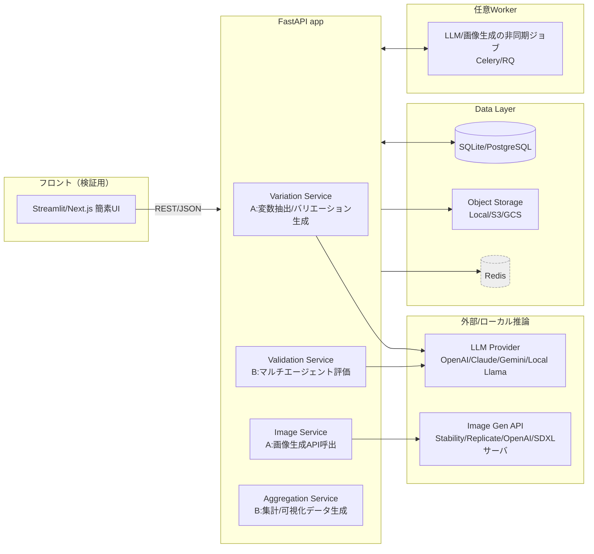
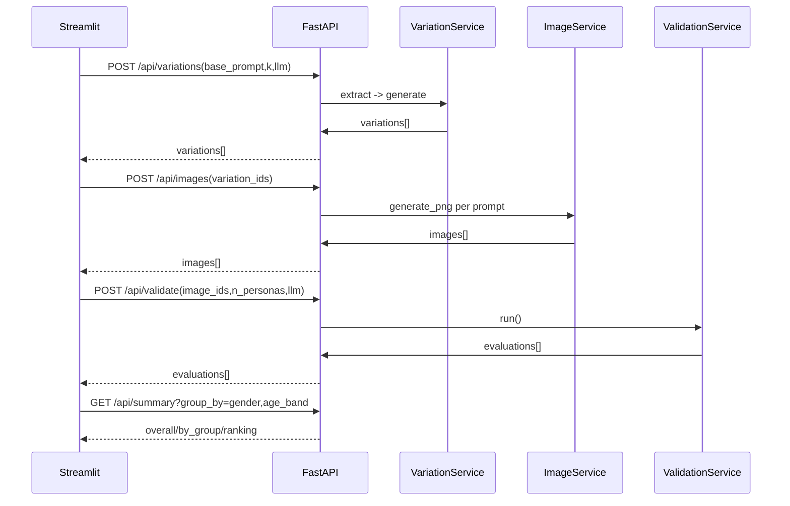

# クリエイティブ生成×マルチエージェント検証 PoC 仕様書（実装レディ）

**前提の確定**  

- LLM：**A案（ベンダ直接呼出）**を採用  
  - テキスト系：**OpenAI**（例：`gpt-4o-mini`）と **Gemini**（例：`gemini-2.0-flash`）  
- 画像生成：**Gemini（画像生成：nanobanana 系）** を優先利用  
  - モデル名は環境変数で差し替え可能：`GEMINI_IMAGE_MODEL=gemini-nanobanana`（仮称）  
- ランタイム：Python 3.11、Docker、**uv**（依存固定）  
- API：FastAPI、DB：PoCは SQLite（将来 Postgres 切替を想定）  
- フロント：最小 Streamlit（触れる用）  
- 非同期ジョブ：**なし（PoC最小）**。将来 Celery/Redis 追加可能。

## 0. 実装機能 このシステムで実現したいもの（機能的ゴール）

本システムのPoCで実現したいのは、クリエイティブ生成と市場評価を一体化した最小の検証環境です。具体的には以下の機能を提供します。

### クリエイティブ・バリエーション生成

- ユーザーが与えたベースプロンプトから主要な変数（モチーフ・スタイル・コンセプト・制約条件など）を抽出する。
- 抽出した変数を組み合わせ、多様な画像生成用プロンプトを自動で生成する。
- Gemini の画像生成モデル（nanobanana）を用いて、各バリエーションに対応する画像を生成する。

### マルチエージェント評価（バリデーション）

- 年齢・性別・地域・職業背景などが異なる100名規模の仮想ペルソナを自動生成する。
- 各ペルソナが生成画像を確認し、あらかじめ定義されたルーブリックに基づいてスコア付けと短評を行う。
- 評価結果を集計し、全体平均・画像別ランキング・属性別平均値を算出する。

### 可視化と比較

- 評価結果をAPI経由で取得し、シンプルなフロントエンドで表示する。
- 画像ごとの順位比較や、ペルソナ属性ごとの評価傾向を可視化することで、**「どのバリエーションがどの層に響くか」**を即座に把握できる。

## 1. アーキテクチャ（Mermaid）



---

## 2. ディレクトリ構成（実装用）

```
repo/
├─ app/
│  ├─ main.py
│  ├─ api/
│  │  ├─ routes_variation.py
│  │  ├─ routes_image.py
│  │  ├─ routes_validation.py
│  │  └─ routes_summary.py
│  ├─ services/
│  │  ├─ variation.py
│  │  ├─ image_gen.py
│  │  ├─ validation.py
│  │  └─ aggregation.py
│  ├─ models/
│  │  ├─ schemas.py
│  │  └─ entities.py
│  ├─ prompts/
│  │  ├─ system_extract.md
│  │  ├─ system_variation.md
│  │  ├─ system_validator.md
│  │  └─ rubric.json
│  ├─ data/
│  │  └─ personas_seed.csv
│  ├─ utils/
│  │  ├─ llm_client.py
│  │  ├─ image_client.py
│  │  ├─ sampler.py
│  │  └─ storage.py
│  └─ static/           # 生成画像出力
├─ frontend/
│  └─ app.py            # Streamlit 最小UI
├─ infra/
│  ├─ Dockerfile
│  ├─ docker-compose.yml   # （任意、PoCは単体で可）
│  └─ .env.example
├─ pyproject.toml
├─ uv.lock
├─ README.md
└─ tests/
   ├─ test_variation.py
   ├─ test_validation.py
   └─ test_api_smoke.py
```

---

## 3. 環境変数（.env.example）

```dotenv
# FastAPI
APP_ENV=local
APP_PORT=8000

# LLM
OPENAI_API_KEY=***
OPENAI_TEXT_MODEL=gpt-4o-mini
GEMINI_API_KEY=***
GEMINI_TEXT_MODEL=gemini-2.0-flash

# Image generation (Gemini)
GEMINI_IMAGE_MODEL=gemini-nanobanana

# DB
DB_URL=sqlite:///./app.db

# Storage
STATIC_DIR=/app/app/static
```

---

## 4. API 仕様

### 4.1 POST `/api/variations`
- 入力
```json
{ "base_prompt": "魅力的な日本企業の怪獣のキャラクターデザイン", "k": 8, "llm": "gemini" }
```
- 出力
```json
{
  "prompt_run_id": "pr_20250919_001",
  "variations": [
    { "id":"v1","prompt":"... (image-ready prompt)", "trace":{"motif":"...","style":"...","concept":"..."} }
  ]
}
```

### 4.2 POST `/api/images`
- 入力
```json
{ "variation_ids": ["v1","v2","v3"] }
```
- 出力
```json
{
  "images": [
    { "id":"img_001","variation_id":"v1","url":"/static/img_001.png","provider_meta":{"model":"gemini-nanobanana"} }
  ]
}
```

### 4.3 POST `/api/validate`
- 入力
```json
{ "image_ids": ["img_001","img_002"], "n_personas": 100, "llm": "openai" }
```
- 出力
```json
{
  "evaluations": [
    { "persona_id":"p037","image_id":"img_001",
      "scores":{"Appeal":4.2,"BrandFit":4.7,"Originality":3.9,"Clarity":4.1,"CulturalSensitivity":4.8,"overall":4.33},
      "comment":"...", "flags":[] }
  ]
}
```

### 4.4 GET `/api/summary?group_by=gender,age_band`
- 出力（例）
```json
{
  "overall": { "mean_overall": 4.12, "n": 200 },
  "by_group": [
    { "group":{"gender":"F","age_band":"20s"}, "n": 40, "mean_overall": 4.28 }
  ],
  "ranking": [
    { "image_id":"img_001","overall":4.33 }, { "image_id":"img_003","overall":4.10 }
  ]
}
```

---

## 5. スキーマ（`app/models/schemas.py`）

```python
from pydantic import BaseModel, Field, HttpUrl
from typing import List, Dict, Literal, Optional

LLMName = Literal["openai", "gemini"]

class VariationTrace(BaseModel):
    motif: str
    style: str
    concept: str
    constraints: List[str] = []
    palette: Optional[str] = None
    target_audience: Optional[str] = None
    brand_tone: Optional[str] = None

class VariationOut(BaseModel):
    id: str
    prompt: str
    trace: VariationTrace

class VariationsRequest(BaseModel):
    base_prompt: str
    k: int = Field(10, ge=1, le=32)
    llm: LLMName = "gemini"

class VariationsResponse(BaseModel):
    prompt_run_id: str
    variations: List[VariationOut]

class ImagesRequest(BaseModel):
    variation_ids: List[str]

class ImageOut(BaseModel):
    id: str
    variation_id: str
    url: str
    provider_meta: Dict[str, str] = {}

class ImagesResponse(BaseModel):
    images: List[ImageOut]

class ValidateRequest(BaseModel):
    image_ids: List[str]
    n_personas: int = Field(100, ge=10, le=300)
    llm: LLMName = "openai"

class Scores(BaseModel):
    Appeal: float
    BrandFit: float
    Originality: float
    Clarity: float
    CulturalSensitivity: float
    overall: float

class EvaluationOut(BaseModel):
    persona_id: str
    image_id: str
    scores: Scores
    comment: str
    flags: List[str] = []

class ValidateResponse(BaseModel):
    evaluations: List[EvaluationOut]
```

---

## 6. 永続モデル（`app/models/entities.py`）

```python
from sqlalchemy.orm import declarative_base, relationship, Mapped, mapped_column
from sqlalchemy import String, Integer, Float, JSON, ForeignKey, DateTime, func

Base = declarative_base()

class PromptRun(Base):
    __tablename__ = "prompt_runs"
    id: Mapped[str] = mapped_column(String, primary_key=True)
    base_prompt: Mapped[str] = mapped_column(String)
    k: Mapped[int] = mapped_column(Integer)
    created_at: Mapped[str] = mapped_column(DateTime, server_default=func.now())

class Variation(Base):
    __tablename__ = "variations"
    id: Mapped[str] = mapped_column(String, primary_key=True)
    prompt_run_id: Mapped[str] = mapped_column(ForeignKey("prompt_runs.id"))
    prompt: Mapped[str] = mapped_column(String)
    trace: Mapped[dict] = mapped_column(JSON)

class GeneratedImage(Base):
    __tablename__ = "generated_images"
    id: Mapped[str] = mapped_column(String, primary_key=True)
    variation_id: Mapped[str] = mapped_column(ForeignKey("variations.id"))
    url: Mapped[str] = mapped_column(String)
    meta: Mapped[dict] = mapped_column(JSON)

class Persona(Base):
    __tablename__ = "personas"
    id: Mapped[str] = mapped_column(String, primary_key=True)
    attrs: Mapped[dict] = mapped_column(JSON)

class Evaluation(Base):
    __tablename__ = "evaluations"
    id: Mapped[int] = mapped_column(Integer, primary_key=True, autoincrement=True)
    persona_id: Mapped[str] = mapped_column(ForeignKey("personas.id"))
    image_id: Mapped[str] = mapped_column(ForeignKey("generated_images.id"))
    scores: Mapped[dict] = mapped_column(JSON)
    comment: Mapped[str] = mapped_column(String)
    created_at: Mapped[str] = mapped_column(DateTime, server_default=func.now())
```

---

## 7. ユーティリティ層

### 7.1 LLM クライアント（`app/utils/llm_client.py`）

```python
from typing import Literal, Dict, Any
import os
import httpx

LLMName = Literal["openai", "gemini"]

class LLMClient:
    """統一インターフェース：prompt -> text"""
    def __init__(self, provider: LLMName):
        self.provider = provider
        if provider == "openai":
            self.api_key = os.environ["OPENAI_API_KEY"]
            self.model = os.getenv("OPENAI_TEXT_MODEL", "gpt-4o-mini")
        else:
            self.api_key = os.environ["GEMINI_API_KEY"]
            self.model = os.getenv("GEMINI_TEXT_MODEL", "gemini-2.0-flash")

    async def complete(self, system: str, user: str) -> str:
        if self.provider == "openai":
            return await self._openai_chat(system, user)
        else:
            return await self._gemini_chat(system, user)

    async def _openai_chat(self, system: str, user: str) -> str:
        headers = {"Authorization": f"Bearer {self.api_key}"}
        payload = {
          "model": self.model,
          "messages": [{"role":"system","content":system},
                       {"role":"user","content":user}],
          "temperature": 0.4
        }
        async with httpx.AsyncClient(timeout=60) as client:
            r = await client.post("https://api.openai.com/v1/chat/completions",
                                  headers=headers, json=payload)
            r.raise_for_status()
            return r.json()["choices"][0]["message"]["content"]

    async def _gemini_chat(self, system: str, user: str) -> str:
        # Gemini の実SDK/HTTP 実装に差し替え予定
        raise NotImplementedError("Implement Gemini chat via official SDK/HTTP")
```

**解説**  
- PoCは「**テキスト出力＝JSON文字列**」を想定。呼び出し側で `json.loads` して検証。  
- 将来 LiteLLM へ差し替え可能。

---

### 7.2 画像クライアント（`app/utils/image_client.py`）

```python
import os, base64, httpx, uuid, pathlib

class GeminiImageClient:
    """Gemini の画像生成（nanobanana）呼び出しと保存"""
    def __init__(self):
        self.api_key = os.environ["GEMINI_API_KEY"]
        self.model = os.getenv("GEMINI_IMAGE_MODEL", "gemini-nanobanana")
        self.static_dir = pathlib.Path(os.getenv("STATIC_DIR","/app/app/static"))
        self.static_dir.mkdir(parents=True, exist_ok=True)

    async def generate_png(self, prompt: str) -> str:
        # 実API仕様に合わせて実装すること
        headers = {"Authorization": f"Bearer {self.api_key}"}
        payload = {"model": self.model, "prompt": prompt}
        async with httpx.AsyncClient(timeout=None) as client:
            r = await client.post("https://generativeai.googleapis.com/v1beta/images:generate",
                                  params={"key": self.api_key}, json=payload)
            r.raise_for_status()
            b64 = r.json()["images"][0]["b64_png"]
        img_id = f"img_{uuid.uuid4().hex[:8]}"
        out = self.static_dir / f"{img_id}.png"
        out.write_bytes(base64.b64decode(b64))
        return str(out)
```

**解説**  
- `images:generate` は**雛形**。Gemini 画像 API の **最新ドキュメント**に合わせて修正（SDK推奨）。  
- 返り値は保存先の**絶対パス**。API 層で `/static/...` URL へ変換。

---

### 7.3 ストレージ（`app/utils/storage.py`）

```python
from pathlib import Path
import os

def to_public_url(abs_path: str) -> str:
    static_dir = os.getenv("STATIC_DIR","/app/app/static")
    rel = abs_path.replace(static_dir, "").lstrip("/")
    return f"/static/{rel}"
```

---

### 7.4 サンプラ（`app/utils/sampler.py`）

```python
import csv, random, uuid
from typing import List, Dict

def sample_personas(n: int, seed_csv: str) -> List[Dict]:
    """seed_csv の分布に基づき n 件のペルソナ属性を合成"""
    rows = []
    with open(seed_csv, newline="", encoding="utf-8") as f:
        for r in csv.DictReader(f):
            rows.append(r)
    out = []
    for _ in range(n):
        r = random.choice(rows)
        out.append({
          "id": f"p_{uuid.uuid4().hex[:6]}",
          "gender": r["gender"],
          "age_band": r["age_band"],
          "region": r["region"],
          "background": r["background"],
          "familiarity": r["familiarity"]
        })
    return out
```

---

## 8. サービス層

### 8.1 変数抽出／バリエーション（`app/services/variation.py`）

```python
import json, uuid, random
from pathlib import Path
from typing import List, Dict
from app.utils.llm_client import LLMClient
from app.models.schemas import VariationTrace, VariationOut

class VariationService:
    def __init__(self, llm_provider: str, prompt_dir: Path):
        self.llm = LLMClient(llm_provider)        # "openai" | "gemini"
        self.prompt_dir = prompt_dir

    async def extract_variables(self, base_prompt: str) -> Dict:
        system = (self.prompt_dir/"system_extract.md").read_text(encoding="utf-8")
        user = f"BASE_PROMPT:\n{base_prompt}\n\n出力はJSONのみ。"
        text = await self.llm.complete(system, user)
        data = json.loads(text)
        return data

    async def generate_variations(self, variables: Dict, k: int) -> List[VariationOut]:
        system = (self.prompt_dir/"system_variation.md").read_text(encoding="utf-8")
        motifs = variables.get("motif", [])
        styles = variables.get("style", [])
        concepts = variables.get("concept", [])
        constraints = variables.get("constraints", [])
        palette = variables.get("palette")

        candidates = []
        for _ in range(k):
            m = random.choice(motifs) if motifs else ""
            s = random.choice(styles) if styles else ""
            c = random.choice(concepts) if concepts else ""
            user = json.dumps({
              "motif": m, "style": s, "concept": c,
              "constraints": constraints, "palette": palette
            }, ensure_ascii=False)
            prompt = await self.llm.complete(system, user)  # image-ready prompt
            candidates.append(VariationOut(
                id=f"v_{uuid.uuid4().hex[:8]}",
                prompt=prompt,
                trace=VariationTrace(
                    motif=m, style=s, concept=c,
                    constraints=constraints, palette=palette
                )
            ))
        return candidates
```

**ポイント**  
- `system_extract.md` は**抽出 JSON スキーマ厳守**を指示。  
- `system_variation.md` は**制約順守**と**英語の画像向けプロンプト**出力を指示。

---

### 8.2 画像生成（`app/services/image_gen.py`）

```python
from typing import List, Tuple
import uuid
from app.utils.image_client import GeminiImageClient
from app.utils.storage import to_public_url
from app.models.schemas import ImageOut

class ImageService:
    def __init__(self):
        self.cli = GeminiImageClient()

    async def create_images(self, pairs: List[Tuple[str, str]]) -> List[ImageOut]:
        # pairs: [(variation_id, prompt), ...]
        out = []
        for vid, prompt in pairs:
            abs_path = await self.cli.generate_png(prompt)
            url = to_public_url(abs_path)
            out.append(ImageOut(
                id=f"img_{uuid.uuid4().hex[:8]}",
                variation_id=vid,
                url=url,
                provider_meta={"model":"gemini-nanobanana"}
            ))
        return out
```

---

### 8.3 マルチエージェント評価（`app/services/validation.py`）

```python
import json
from typing import Dict, List
from pathlib import Path
from app.utils.llm_client import LLMClient
from app.utils.sampler import sample_personas
from app.models.schemas import EvaluationOut, Scores

class ValidationService:
    def __init__(self, llm_provider: str, prompt_dir: Path, seed_csv: str):
        self.llm = LLMClient(llm_provider)
        self.prompt_dir = prompt_dir
        self.seed_csv = seed_csv

    async def _validate_one(self, persona: Dict, image_meta: Dict) -> EvaluationOut:
        system = (self.prompt_dir/"system_validator.md").read_text(encoding="utf-8")
        rubric = (self.prompt_dir/"rubric.json").read_text(encoding="utf-8")
        user = json.dumps({
          "persona": persona,
          "image": image_meta,
          "rubric": json.loads(rubric)
        }, ensure_ascii=False)
        text = await self.llm.complete(system, user)
        data = json.loads(text)
        sc = data["scores"]
        return EvaluationOut(
            persona_id=persona["id"],
            image_id=image_meta["id"],
            scores=Scores(**sc),
            comment=data["comment"],
            flags=data.get("flags", [])
        )

    async def run(self, image_list: List[Dict], n_personas: int) -> List[EvaluationOut]:
        personas = sample_personas(n_personas, self.seed_csv)
        results: List[EvaluationOut] = []
        for img in image_list:
            for p in personas:
                r = await self._validate_one(p, img)
                results.append(r)
        return results
```

**ポイント**  
- PoC は**逐次実行**（並列不要）。将来はバッチ or 並列化に切替。  
- `rubric.json` で重み・説明を定義。

---

### 8.4 集計（`app/services/aggregation.py`）

```python
from typing import List, Dict
import pandas as pd

def summarize(evals: List[Dict], group_keys: List[str]) -> Dict:
    df = pd.DataFrame([{
      "image_id": e["image_id"],
      "persona_id": e["persona_id"],
      "overall": e["scores"]["overall"],
      **e.get("group", {})
    } for e in evals])
    overall = {"mean_overall": float(df["overall"].mean()), "n": int(len(df))}
    by_group = []
    if group_keys:
        g = df.groupby(group_keys)["overall"].agg(["count","mean"]).reset_index()
        for _, row in g.iterrows():
            by_group.append({
              "group": {k: row[k] for k in group_keys},
              "n": int(row["count"]),
              "mean_overall": float(row["mean"])
            })
    ranking = (df.groupby("image_id")["overall"]
               .mean().sort_values(ascending=False)
               .reset_index().rename(columns={"overall":"overall"}))
    rank = [{"image_id": r["image_id"], "overall": float(r["overall"])}
            for _, r in ranking.iterrows()]
    return {"overall": overall, "by_group": by_group, "ranking": rank}
```

---

## 9. ルーティング層（例：`app/api/routes_variation.py`）

```python
from fastapi import APIRouter, Depends
from pathlib import Path
from app.models.schemas import VariationsRequest, VariationsResponse
from app.services.variation import VariationService

router = APIRouter(prefix="/api/variations", tags=["variations"])

def svc(req_llm: str = "gemini"):
    return VariationService(req_llm, Path("app/prompts"))

@router.post("", response_model=VariationsResponse)
async def create_variations(body: VariationsRequest, service: VariationService = Depends(svc)):
    variables = await service.extract_variables(body.base_prompt)
    vars = await service.generate_variations(variables, body.k)
    prompt_run_id = "pr_" + vars[0].id[:4]  # PoC簡易
    return {"prompt_run_id": prompt_run_id, "variations": [v.dict() for v in vars]}
```

他エンドポイントも同様に実装。

---

## 10. プロンプト（抜粋）

### `prompts/system_extract.md`
- **抽出 JSON のみ**を返す。キー：`motif, style, concept, constraints, palette, target_audience, brand_tone`
- 各配列は 1–4 要素。意味差があること、重複禁止。
- **日本市場向け**。暴力・差別・過度な性的表現を回避。
- **出力は JSON 文字列のみ**（前後の説明禁止）。

### `prompts/system_variation.md`
- 画像API向け**英語プロンプト**を合成。
- 構図/照明/質感/解像度ヒントを含める。
- 企業フレンドリー、**non-violent**, **approachable** を既定。
- **出力は生テキスト 1 本のみ**（説明やJSON禁止）。

### `prompts/system_validator.md`
- ペルソナ人格で**採点＋短評**を JSON で返す。
- 0.0–5.0（小数1桁）。コメントは日本語 50–120字、具体的改善 1 点。
- 攻撃/差別的表現禁止、制作推測の断定禁止。
- **出力 JSON**：`{scores:{...}, comment:"", flags:[]}`。

### `prompts/rubric.json`（例）
```json
{
  "weights": {"Appeal":0.25,"BrandFit":0.25,"Originality":0.2,"Clarity":0.2,"CulturalSensitivity":0.1},
  "criteria": {
    "Appeal": "視覚的に魅力的か。配色/形状/バランス。",
    "BrandFit": "日本企業らしさ、信頼・清潔・堅実の表現。",
    "Originality": "既視感の低さ、差別化。",
    "Clarity": "意図が直感的に伝わるか。",
    "CulturalSensitivity": "文化的配慮、過度な暴力/性的誇張の回避。"
  }
}
```

---

## 11. フロント（`frontend/app.py`）
- Tab1：ベースプロンプト→`/api/variations`→一覧  
- Tab2：選択した variation を `/api/images` 実行→サムネ表示  
- Tab3：`/api/validate` 実行→ `/api/summary` 可視化（棒グラフ）  

---

## 12. 実装上の注意／解説

1. **Gemini 画像 API**  
   - 本仕様は **nanobanana** モデルを想定した雛形。実際の**エンドポイント・認証・レスポンスキー**は最新ドキュメントに合わせて `image_client.py` を調整（SDK化推奨）。  
   - 返却が **base64 PNG** 前提のため、**保存→/static 配信**の流れ。

2. **JSON 厳格性**  
   - 抽出・評価は **LLM が JSON 文字列**を返す前提。**Pydantic で検証**し、キー欠損や型不一致は 400 。  
   - プロンプト注入対策：system 側で**「出力は JSON のみ」**を強制。

3. **評価の信頼性**  
   - 100 エージェントは「**擬似フォーカスグループ**」。偏りの可能性を README に明記。  
   - 将来：**実ユーザー A/B** と突合し**重み学習**で校正。

4. **パフォーマンス**  
   - PoC は逐次。画像×100人評価は重いため検証時は件数を絞る。  
   - 将来：`asyncio.gather`／ジョブキュー（Celery）で並列化。

5. **再現性**  
   - `uv.lock` 固定。LLM は非決定的なので **temperature=0.2–0.4** を基本。  
   - 乱択サンプルは `random.seed` で制御可能。

6. **安全性**  
   - `constraints` に**暴力・差別・性的誇張回避**を常時注入。  
   - コメントは**攻撃表現フィルタ**（簡易NGワード）を追加可能。

---

## 13. シーケンス（参考）



---

## 14. Docker / uv

**infra/Dockerfile**
```dockerfile
FROM python:3.11-slim
WORKDIR /app
RUN pip install uv
COPY pyproject.toml uv.lock ./
RUN uv sync --frozen
COPY app ./app
ENV STATIC_DIR=/app/app/static
EXPOSE 8000
CMD ["uv", "run", "uvicorn", "app.main:app", "--host", "0.0.0.0", "--port", "8000"]
```

**pyproject.toml（主要）**
```toml
[project]
name = "creative-validation-poc"
version = "0.2.0"
requires-python = ">=3.11"
dependencies = [
  "fastapi", "uvicorn[standard]", "pydantic>=2",
  "sqlalchemy", "httpx", "python-dotenv", "structlog",
  "pandas", "plotly", "numpy"
]
```

---

## 15. `app/main.py`（エントリ）

```python
from fastapi import FastAPI
from fastapi.staticfiles import StaticFiles
from app.api import routes_variation, routes_image, routes_validation, routes_summary

app = FastAPI(title="Creative Gen & Validation PoC")
app.include_router(routes_variation.router)
app.include_router(routes_image.router)
app.include_router(routes_validation.router)
app.include_router(routes_summary.router)

app.mount("/static", StaticFiles(directory="app/static"), name="static")
```

---

## 16. 最小テスト観点

- `/api/variations`：JSON スキーマ準拠、k 件の prompt が返る  
- `/api/images`：PNG 保存と URL 参照  
- `/api/validate`：`n_personas * len(images)` 件の評価、スコア範囲 0.0–5.0  
- `/api/summary`：group_by 軸で平均・N 表示

---

### 付録：`personas_seed.csv` ヘッダ例

```
gender,age_band,region,background,familiarity
F,20s,JP,office worker,high
M,30s,JP,engineer,medium
F,40s,US,designer,low
...
```
