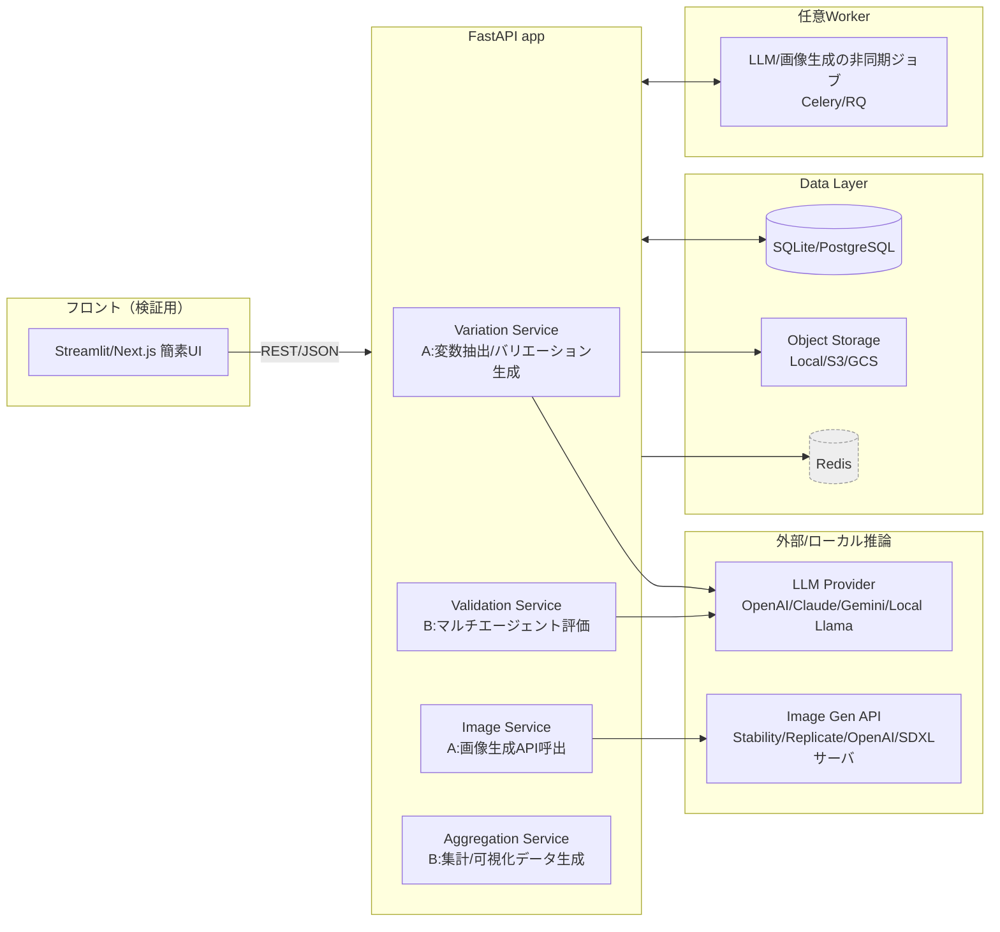

```mermaid
flowchart LR
  subgraph Client [フロント（検証用）]
    UI1[Streamlit/Next.js 簡素UI]
  end

  subgraph API [FastAPI app]
    VGEN[Variation Service<br/>A:変数抽出/バリエーション生成]
    IMG[Image Service<br/>A:画像生成API呼出]
    VALI[Validation Service<br/>B:マルチエージェント評価]
    AGG[Aggregation Service<br/>B:集計/可視化データ生成]
  end

  subgraph Workers [任意Worker]
    W1[LLM/画像生成の非同期ジョブ<br/>Celery/RQ]
  end

  subgraph Data [Data Layer]
    DB[(SQLite/PostgreSQL)]
    OBJ[Object Storage<br/>Local/S3/GCS]
    CACHE[(Redis)]
  end

  subgraph Providers [外部/ローカル推論]
    LLM1[LLM Provider<br/>OpenAI/Claude/Gemini/Local Llama]
    IMG1[Image Gen API<br/>Stability/Replicate/OpenAI/SDXLサーバ]
  end

  UI1-->|REST/JSON|API
  API<-->DB
  API-->OBJ
  API-->CACHE
  VGEN-->LLM1
  VALI-->LLM1
  IMG-->IMG1
  API<-->W1
  
  classDef opt fill:#eee,stroke:#999,stroke-dasharray:4 2;
  class CACHE opt;

```